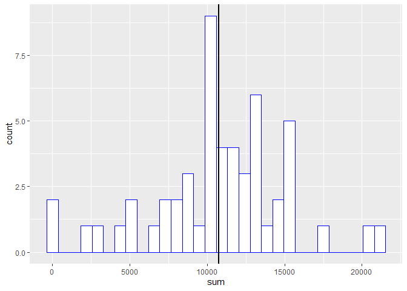
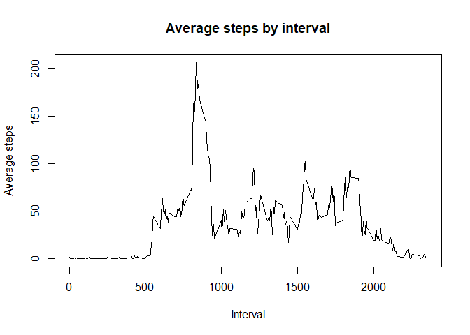
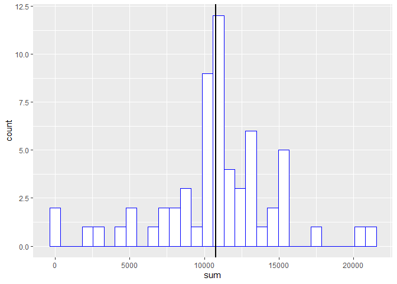
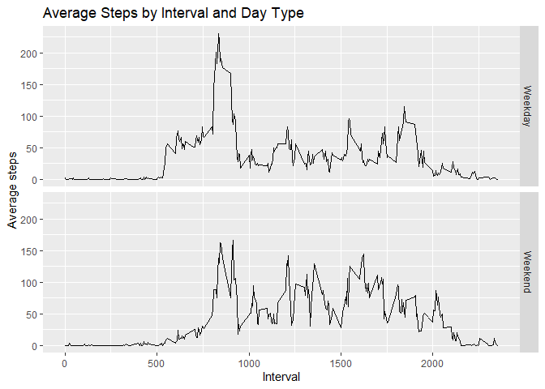

## Loading and preprocessing the data
### Code for reading in the dataset and/or processing the data

```r
if(!file.exists("activity.zip")){
download.file("https://d396qusza40orc.cloudfront.net/repdata%2Fdata%2Factivity.zip", destfile = "activity.zip" )}
df<-read_csv("activity.zip")
```

```
## Parsed with column specification:
## cols(
##   steps = col_double(),
##   date = col_date(format = ""),
##   interval = col_double()
## )
```

## What is mean total number of steps taken per day?
Find the total steps per day

```r
totalstepbydate<-df%>%group_by(date)%>%
        summarise(sum=sum(steps))
head(totalstepbydate)
```

```
## # A tibble: 6 x 2
##   date         sum
##   <date>     <dbl>
## 1 2012-10-01    NA
## 2 2012-10-02   126
## 3 2012-10-03 11352
## 4 2012-10-04 12116
## 5 2012-10-05 13294
## 6 2012-10-06 15420
```
### Mean and median number of steps taken each day
Calculate the median total steps per day and the mean total steps per day

```r
medianstepbydate<-median(totalstepbydate$sum, na.rm = TRUE)
meanstepbydate<-mean(totalstepbydate$sum, na.rm = TRUE)
print(medianstepbydate)
```

```
## [1] 10765
```

```r
print(meanstepbydate)
```

```
## [1] 10766.19
```
### Histogram of the total number of steps taken each day

```r
#Create a histogram for total steps per day

g<-ggplot(data = totalstepbydate, aes(x = sum))+
        geom_histogram(color = "blue", fill = "white")+
        geom_vline(aes(xintercept = meanstepbydate), size = 1)
g
```

```
## `stat_bin()` using `bins = 30`. Pick better value with `binwidth`.
```



## What is the average daily activity pattern?

```r
intervalavgstep<-df%>%group_by(interval)%>%
        summarise(intavgstep=mean(steps, na.rm = TRUE))
head(intervalavgstep)
```

```
## # A tibble: 6 x 2
##   interval intavgstep
##      <dbl>      <dbl>
## 1        0     1.72  
## 2        5     0.340 
## 3       10     0.132 
## 4       15     0.151 
## 5       20     0.0755
## 6       25     2.09
```
### The 5-minute interval that, on average, contains the maximum number of steps

```r
maxint<-filter(intervalavgstep, intavgstep == max(intervalavgstep$intavgstep))
print(maxint)
```

```
## # A tibble: 1 x 2
##   interval intavgstep
##      <dbl>      <dbl>
## 1      835       206.
```
### Time series plot of the average number of steps taken

```r
plot(intervalavgstep$interval, intervalavgstep$intavgstep, 
     type = "l", 
     xlab = "Interval", 
     ylab = "Average steps", 
     main = "Average steps by interval")
```



## Imputing missing values

```r
missing<-sum(is.na(df$steps))
print(missing)
```

```
## [1] 2304
```
### Code to describe and show a strategy for imputing missing data

```r
imputed<-df
imputed$steps<-ave(imputed$steps,imputed$interval,FUN=function(x) 
        ifelse(is.na(x), mean(x,na.rm=TRUE), x))
        

imputedsum<-imputed%>%group_by(date)%>%
        summarise(sum=sum(steps))
        
impmedianstepbydate<-median(imputedsum$sum, na.rm = TRUE)

impmeanstepbydate<-mean(imputedsum$sum, na.rm = TRUE)
```
### Histogram of the total number of steps taken each day after missing values are imputed
The vertical line represents the mean.

```r
g2<-ggplot(data = imputedsum, aes(x = sum))+
        geom_histogram(color = "blue", fill = "white", bins = 30)+
        geom_vline(aes(xintercept = meanstepbydate), size = 1)
g2
```



## Are there differences in activity patterns between weekdays and weekends?

```r
imputed$day<-weekdays(imputed$date)
imputed$factor <- sapply(imputed$day, function(x) {
        if (x == "Saturday" | x =="Sunday") 
        {y <- "Weekend"} else 
        {y <- "Weekday"}
        y
})
imputed<-imputed%>%group_by(interval, factor)%>%
        summarise(avg = mean(steps))
```
### Panel plot comparing the average number of steps taken per 5-minute interval across weekdays and weekends


```r
g3<-ggplot(imputed, aes(imputed$interval, imputed$avg) ) +
        geom_line()+
        facet_grid(rows = vars(factor))+
        labs(x = "Interval", 
             y = "Average steps", 
             title = "Average Steps by Interval and Day Type")
g3
```


